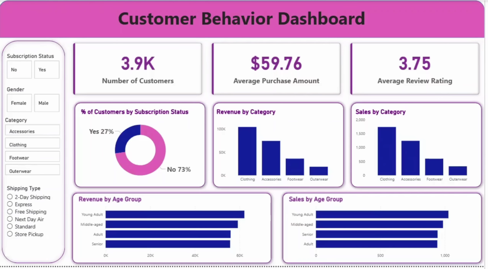

# 🛒 Retail Consumer Pattern Analysis


---

## 📌 Problem Statement

A leading retail company was struggling to understand *why* customers buy what they buy — and more importantly, *who* their most valuable customers actually are. The management team noticed shifts in purchasing patterns across different age groups, product categories, and sales channels, but had no clear data-driven explanation for them.

This project was built to answer one core business question:

> **"How can the company leverage consumer shopping data to identify trends, improve customer engagement, and optimize marketing and product strategies?"**

---

## 🎯 What This Project Covers

- Which customer segments drive the most revenue
- How discounts, reviews, and shipping preferences affect buying behavior
- Whether subscribed customers actually spend more than non-subscribers
- Which products are most loved (and most discount-dependent)
- What age groups the business should be prioritizing in its marketing

---

## 🗂️ Project Structure

```
retail-consumer-pattern-analysis/
│
├── 📁 data/
│   └── data.csv                  # Raw dataset — 3,900 rows, 18 columns
│
├── 📁 notebooks/
│   └── Notebook.ipynb            # Full EDA, data cleaning & feature engineering
│
├── 📁 sql/
│   └── sql_queries.sql           # 10 business queries written in PostgreSQL
│
├── 📁 dashboard/
│   ├── PowerBI.pbix              # Interactive Power BI dashboard
│   └── Dashboard.png             # Dashboard preview screenshot
│
├── 📁 reports/
│   ├── Analysis_Report.pdf       # Full project write-up and findings
│   └── Business_Problem.pdf      # Original project brief
│
├── README.md                     # You're reading it!
└── requirements.txt              # Python libraries needed to run the notebook
```

---

## 📊 About the Dataset

The dataset contains **3,900 retail transactions** with **18 features** covering everything from customer demographics to shipping preferences.

| Property | Detail |
|---|---|
| Rows | 3,900 |
| Columns | 18 |
| Missing Data | 37 null values in `Review Rating` — handled via median imputation |

**What's in the data:**
- Customer info — Age, Gender, Location, Subscription Status
- Purchase details — Item, Category, Amount (USD), Season, Size, Color
- Behavior signals — Discount Applied, Previous Purchases, Review Rating, Shipping Type, Payment Method

---

## 🔧 Tech Stack

| Tool | What I Used It For |
|---|---|
| **Python + Pandas** | Data cleaning, transformation, and exploratory analysis |
| **Jupyter Notebook** | Interactive environment to document the full analysis |
| **PostgreSQL** | Running structured business queries on the cleaned data |
| **Power BI** | Building the interactive dashboard for stakeholders |

---

## 🐍 Python — Data Cleaning & Exploration

Everything in this phase lives inside `notebooks/Notebook.ipynb`. Here's what was done:

**Cleaning:**
- Checked data structure with `df.info()` and `df.describe()`
- Found 37 missing values in `Review Rating` — filled using the **median rating per product category** (better than a global median since ratings differ by product type)
- Renamed all columns to `snake_case` for cleaner, consistent code
- Discovered `discount_applied` and `promo_code_used` were identical columns — dropped `promo_code_used`

**Feature Engineering:**
- Built an `age_group` column by binning customer ages into meaningful segments (Young Adult, Adult, Middle-aged, Senior)
- Created a `purchase_frequency_days` column from the text-based frequency field

**Database Integration:**
- Connected to PostgreSQL using `SQLAlchemy`
- Loaded the cleaned DataFrame directly into the database for SQL analysis

---

## 🗃️ SQL — Business Queries

All queries are in `sql/sql_queries.sql` and were run on PostgreSQL. Each one was written to answer a real business question, not just to practice syntax.

| # | Question | Technique Used |
|---|---|---|
| Q1 | How much revenue do male vs. female customers generate? | `GROUP BY`, `SUM` |
| Q2 | Which discount users still spend above average? | Subquery, `WHERE` |
| Q3 | What are the top 5 products by review rating? | `AVG`, `ORDER BY`, `LIMIT` |
| Q4 | Do Express shipping customers spend more than Standard? | Filtered `AVG` |
| Q5 | Do subscribers actually spend more than non-subscribers? | `COUNT`, `AVG`, `SUM` |
| Q6 | Which products are most dependent on discounts? | `CASE WHEN`, percentage |
| Q7 | Can we segment customers into New, Returning, and Loyal? | `CTE`, `CASE WHEN` |
| Q8 | What are the top 3 products in each category? | `CTE`, `ROW_NUMBER()`, `PARTITION BY` |
| Q9 | Are repeat buyers more likely to subscribe? | `WHERE`, `GROUP BY` |
| Q10 | Which age group contributes the most revenue? | `GROUP BY`, `SUM` |

### Featured Query — Customer Segmentation

One of the more interesting queries: classifying every customer as New, Returning, or Loyal based on their purchase history — using a CTE to keep it readable.

```sql
WITH customer_type AS (
    SELECT customer_id, previous_purchases,
        CASE 
            WHEN previous_purchases = 1 THEN 'New'
            WHEN previous_purchases BETWEEN 2 AND 10 THEN 'Returning'
            ELSE 'Loyal'
        END AS customer_segment
    FROM customer
)
SELECT customer_segment, COUNT(*) AS "Number of Customers" 
FROM customer_type 
GROUP BY customer_segment;
```

**Result:**

| Segment | Customers |
|---|---|
| Loyal | 3,116 |
| Returning | 701 |
| New | 83 |

80% of the customer base is already loyal — which raises an important question: are we doing enough to keep them?

---

## 📈 Key Findings

Here's what the data actually told us:

| Area | Finding |
|---|---|
| 💰 **Gender & Revenue** | Male customers generated $157,890 vs. $75,191 from female customers |
| 📦 **Top Category** | Clothing leads in both total revenue and number of orders |
| ⭐ **Best Rated Product** | Gloves came out on top with an average rating of 3.86 |
| 🚚 **Shipping & Spend** | Express shipping users spend slightly more ($60.48 vs. $58.46 for Standard) |
| 🏷️ **Subscription Rate** | Only 27% of customers are subscribed — a big growth opportunity |
| 🔁 **Loyalty Breakdown** | 80% Loyal, 18% Returning, 2% New |
| 👥 **Top Age Group** | Young Adults contribute the highest revenue at $62,143 |
| 🎟️ **Discount Dependency** | Hat has the highest discount purchase rate at exactly 50% |
| 🔄 **Repeat Buyers** | Most repeat buyers are non-subscribers (2,518 vs. 958) — loyal without the subscription |

---

## 📊 Power BI Dashboard

The dashboard was built to give stakeholders a quick, filterable view of all key metrics without needing to dig into raw data.



**What's on the dashboard:**
- KPI cards — Total Customers (3.9K), Average Purchase Amount ($59.76), Average Review Rating (3.75)
- Revenue and Sales by Category
- Revenue and Sales by Age Group
- Subscription Status breakdown (donut chart)
- Filters for Gender, Category, Subscription Status, and Shipping Type

---

## 💡 Business Recommendations

Based on the analysis, here's what I'd recommend to the business:

**1. Make the subscription program more attractive**
Only 1 in 4 customers subscribes. Given that 80% of customers are already loyal, there's a real opportunity to convert them into subscribers with better perks — early access, exclusive discounts, or a points system.

**2. Don't over-rely on discounts**
Products like Hat, Sneakers, and Coat have ~50% discount rates. That's a margin risk. It's worth testing whether these products sell at full price with better product positioning or reviews highlighted.

**3. Double down on Young Adults and Middle-aged customers**
These two groups are the top revenue contributors. Targeted campaigns, seasonal promotions, and personalized recommendations for these segments could meaningfully grow revenue.

**4. Promote Express shipping at checkout**
Express shipping users spend slightly more on average. A simple nudge at checkout ("Upgrade to Express for just $X more") could increase average order value.

**5. Showcase top-rated products in marketing**
Gloves, Sandals, Boots, and Hats all have strong ratings. Using real customer ratings in ads and product pages builds trust and can improve conversion rates.

---

## ⚙️ How to Run This Project

**Clone the repo:**
```bash
git clone https://github.com/YOUR_USERNAME/retail-consumer-pattern-analysis.git
cd retail-consumer-pattern-analysis
```

**Install dependencies:**
```bash
pip install -r requirements.txt
```

**Open the notebook:**
```bash
jupyter notebook notebooks/Notebook.ipynb
```

**For SQL:** Load `data/data.csv` into PostgreSQL, then run queries from `sql/sql_queries.sql`

**For the dashboard:** Open `dashboard/PowerBI.pbix` in Power BI Desktop

---

## 📦 Requirements

```
pandas
numpy
matplotlib
seaborn
sqlalchemy
psycopg2-binary
jupyter
```

---


---

*If you found this project helpful or interesting, a ⭐ on the repo would mean a lot!*
